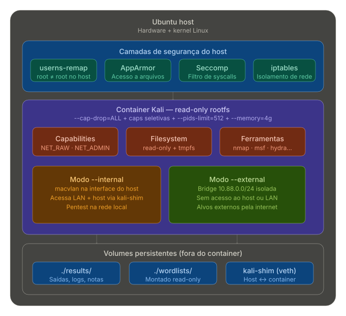

# Pentest_Workspace — Ambiente Kali Hardened

> Ambiente institucional para pentest seguro, automação, hardening, logging e persistência, com governança e documentação completa.

---

## 1. Visão Geral

- **Propósito:** Prover um ambiente Kali Linux containerizado, seguro e auditável, para operações de pentest, automação, blue/red teaming e integração com IA.
- **Destaques:** Hardening avançado (rootfs read-only, seccomp, AppArmor, userns-remap), logging seguro, volumes persistentes, scripts de automação, documentação institucional.

---

## 2. Diagrama de Arquitetura

<p align="center">
  
</p>

---

## 3. Estrutura de Diretórios

```text
Pentest_Workspace/
├── 00_COMMAND_CENTER/      # Orquestração, automação e scripts centrais
│   ├── filter_and_export.sh
│   ├── kali_audit.sh
│   ├── 01_LLM_ORCHESTRATOR/
│   ├── 02_STRATEGY_DECISIONS/
│   ├── 03_SECURE_VAULT/
│   └── ARENA/
│       ├── CANDIDATES/
│       ├── SCORING/
│       └── TEST_CASES/
├── BLUE_TEAM/              # Defesa: hardening, logging, análise, remediação, IA defensiva
│   ├── 01_HARDENING/
│   ├── 02_LOGGING/
│   ├── 03_ANALYSIS/
│   ├── 04_REMEDIATION/
│   ├── 05_AI_DEFENSE/
│   │   └── rule_01_prohibit_listing.md
│   └── README.md
├── RED_TEAM/               # Ofensiva: OSINT, payloads, exploração, POC, IA ofensiva
│   ├── 01_RECON_OSINT/
│   ├── 02_PAYLOADS/
│   │   └── check.txt
│   ├── 03_EXPLOITATION/
│   ├── 04_REPORTING_POC/
│   ├── 05_AI_RED_TEAMING/
│   │   └── prompt_injection_v1.txt
│   └── README.md
├── SHARED/                 # Recursos compartilhados (assets, wordlists, base de conhecimento)
│   ├── 01_ASSETS/
│   ├── 02_WORDLISTS/
│   ├── 03_KNOWLEDGE_BASE/
│   └── README.md
├── bottom_x86_64-unknown-linux-gnu/ # Binário e autocompletar do Bottom (btm)
│   ├── btm
│   └── completion/
│       ├── _btm, btm.bash, btm.elv, btm.fish, btm.nu, _btm.ps1, btm.ts
├── config/                 # Configuração do container e shell
│   ├── Dockerfile
│   ├── motd.sh
│   └── zshrc
├── scripts/                # Scripts de automação do ambiente
│   ├── kali-run.sh
│   └── setup.sh
├── seccomp/                # Perfil seccomp customizado
│   └── pentest-seccomp.json
├── wordlists/              # Wordlists persistentes
│   ├── README.txt
│   └── rockyou.txt
├── results/                # Resultados e histórico do shell
│   └── .zsh_history
├── DISTRIBUTION/           # Distribuição de artefatos (OPEN_CORE, PRO_PRIVATE)
│   ├── OPEN_CORE/
│   │   └── check.txt
│   └── PRO_PRIVATE/
├── EXPORTED_TO_HOST/       # Exportação de arquivos do container para o host
├── files/                  # Área livre para arquivos temporários
├── .dockerignore
├── README.md
├── kali_container_architecture.svg
```

---

## 4. Componentes-Chave

- **config/Dockerfile:** Imagem base Kali, hardening, entrypoint seguro, validação de hash, user não-root.
- **scripts/kali-run.sh:** Build, execução, shell, limpeza, scan, logging detalhado, validação GPG.
- **scripts/setup.sh:** Prepara ambiente, permissões, wordlists, backup, hardening do host.
- **seccomp/pentest-seccomp.json:** Perfil restritivo de syscalls, integração AppArmor.
- **config/zshrc:** Shell seguro, aliases, funções de forense, alerta root, integração blue team.
- **bottom_x86_64-unknown-linux-gnu/:** Binário btm e autocompletar para múltiplos shells.
- **results/, wordlists/:** Volumes persistentes, histórico protegido, wordlists de exemplo.
- **DISTRIBUTION/, EXPORTED_TO_HOST/, files/:** Suporte a distribuição, exportação e arquivos temporários.

---

## 5. Como Usar

1. **Preparar ambiente:**

  ```sh
  ./scripts/setup.sh
  ```

2. **Buildar imagem Docker:**

  ```sh
  ./scripts/kali-run.sh --build
  ```

3. **Executar container:**

  ```sh
  ./scripts/kali-run.sh --run
  ```

4. **Acessar shell do container:**

  ```sh
  ./scripts/kali-run.sh --shell
  ```

5. **Limpar container parado:**

  ```sh
  ./scripts/kali-run.sh --clean
  ```

---

## 6. Segurança, Governança e Boas Práticas

- Hardening: rootfs read-only, seccomp, AppArmor, userns-remap, capabilities mínimas.
- Logging seguro, histórico protegido, validação de hash, backup automático.
- Integração blue/red team, automação, IA, scripts de defesa e ataque.
- Documentação institucional, threat modeling, fluxo de atualização segura.
- Políticas institucionais em `02_DOCUMENTACAO/` e `03_ARTIFACTS/`.

---

## 7. Referências e Suporte

- Consulte o owner técnico para dúvidas ou melhorias.
- Para contribuições, siga as normas de commit e documentação do workspace.

---
├── RED_TEAM/               # Materiais, scripts e payloads ofensivos
│   ├── 01_RECON_OSINT/
│   ├── 02_PAYLOADS/
│   │   └── check.txt
│   ├── 03_EXPLOITATION/
│   ├── 04_REPORTING_POC/
│   ├── 05_AI_RED_TEAMING/
│   │   └── prompt_injection_v1.txt
│   └── README.md
├── SHARED/                 # Recursos compartilhados (assets, wordlists, base de conhecimento)
│   ├── 01_ASSETS/
│   ├── 02_WORDLISTS/
│   ├── 03_KNOWLEDGE_BASE/
│   └── README.md
├── bottom_x86_64-unknown-linux-gnu/ # Binário e scripts de autocompletar do Bottom (btm)

## 7. Referências e Suporte

- Consulte o owner técnico para dúvidas ou melhorias.
- Para contribuições, siga as normas de commit e documentação do workspace.
│   └── setup.sh
├── seccomp
│   └── pentest-seccomp.json
├── SHARED
│   ├── 01_ASSETS
│   ├── 02_WORDLISTS
│   ├── 03_KNOWLEDGE_BASE
│   └── README.md
└── wordlists
    ├── README.txt
    └── rockyou.txt

37 directories, 29 files

```text
## Primeiro uso

```bash
# 1. Setup do host (uma única vez)
sudo ./scripts/setup.sh

# 2. Iniciar container
sudo ./scripts/kali-run.sh --external    # Para alvos externos
sudo ./scripts/kali-run.sh --internal    # Para rede local / host Ubuntu
```text

## Melhorias aplicadas vs. comando original

| Aspecto         | Antes                         | Depois                                |
|-----------------|-------------------------------|---------------------------------------|
| Rede            | `--net=host` (sem isolamento) | Bridge/macvlan dedicada por modo      |
| Capabilities    | Só `NET_ADMIN`                | Set completo para pentest             |
| Root filesystem | Read/write total              | `--read-only` + tmpfs                 |
| Recursos        | Ilimitado                     | CPU/RAM/PIDs limitados                |
| Seccomp         | Default Docker                | Perfil customizado para pentest       |
| AppArmor        | Default Docker                | Perfil dedicado `docker-kali-pentest` |
| User namespace  | Root real no host             | `userns-remap=default`                |
| Persistência    | Nenhuma                       | Volumes organizados                   |
| Logging         | Default                       | Limitado (10MB, 3 rotações)           |
| Histórico       | Shell padrão                  | Log de sessão por alvo                |

## Modos de rede

### `--external` (padrão)

### `--internal`

## Segurança

## Ferramentas incluídas

## Aliases úteis

```bash
nmap-fast        # Scan rápido de portas
nmap-stealth     # Scan silencioso (-T2 + fragmentação)
nmap-vuln        # Scripts de vulnerabilidade
gobuster-dir     # Enumeração de diretórios web
pentest-start    # Inicia sessão com log automático
recon <alvo>     # Reconhecimento básico completo
```text

## Dicas de OpSec
