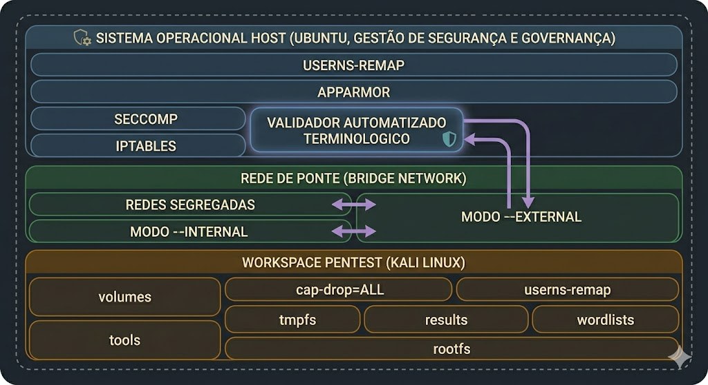

## Quem sou eu?
 > Felipe Machado, Engenheiro Civil, Epecialista em Fundações e Estruturas multidisciplinares.
 > Atualmente atuo no desenvolvmento e estudos de sitemas geridos por Inteligência artificial.
 > Apaixonado por Tecnologia, matemática, Engenharia e Lingua Francesa.

## 🏆 Meus Projetos em Desenvolvimento, implementações e Estudos.

- **Synergie Core (Open-Core):** Orquestração multi-LLM, IA 100% local, governança automatizada.
- **Synergie Security (em Desenvolvimento):** Ambiente Kali Linux containerizado, hardening avançado, automação e logging seguro.
- **Fine-tuning (em Dsenvolvimento):** Fine-tuning no argente **Hermes3:8b**, com o objetivo de torna-lo um e especialista em Engenharia Civil.
   
## 🛠️ Stacks & Skills

  <!-- Linguagens e Frameworks principais -->
  
  
  
  
  
  
  
  
  <!-- IA, LLM e automação -->
  
  
  
  
  
  <!-- DevOps, Infraestrutura e Observabilidade -->
  
  
  
  
  
  
    

## ⚡ Ecossistema Synergie 

O Projeto **Synergie** é um projeto com o objetivo de implementar e desenvolver um ecossistema de workspaces, concebido sob o princípio de soberania tecnológica, automação fail-fast e isolamento. Dividido em duas frentes complementares, o ecossistema atende tanto à engenharia analítica e diária  de desenvolvimento de soluções tecnológicas, quanto à auditoria defensiva e ofensiva de infraestrutura crítica.

- **Automação fail-fast:** Scripts institucionais para setup, validação, backup e auditoria, reduzindo erros manuais.

- **Governança ativa:** Enforcement automático de padrões, validação de documentação e código, histórico linear e compliance contínuo.

- **Componentização:** Estrutura modular para reuso de componentes e templates profissionais (README, ADR, AUDIT, RUNBOOK).

- **Observabilidade:** Integração com dashboards e logs para monitoramento técnico (sem exposição de dados sensíveis).

- **Documentação poliglota:** Dicionário institucional PT-BR/EN/FR e templates para padronização e onboarding rápido.

> Todas as práticas seguem princípios de segurança, privacidade e compliance, sem exposição de informações confidenciais ou segredos de negócio.

<table border="0" width="100%">
  <tr>
    <td width="50%" valign="top" style="border: none; padding-right: 15px;">
      <h3>🤖 Synergie Core (Open-Core)</h3>
      
Workspace de engenharia totalmente apoiado por assistentes inteligentes locais e orquestração multi-LLM independente da nuvem.

      <ul>
        <li><b>IA 100% Local:</b> Modelos executados via Ollama/llama.cpp com logs agregados e dashboards dedicados.</li>
        <li><b>Cojunto de Modelos:</b> Orquestração inteligente com tomada de decisão baseada em voto conceitual mitigando alucinações.</li>
        <li><b>Governança Ativa:</b> Validação automática de schemas e metadados sob modo estrito e impeditivo <i>fail-fast</i>.</li>
      </ul>
      
➔ <code>Foco: Produtividade, privacidade absoluta e conformidade corporativa.</code>

    </td>    
    <td width="50%" valign="top" style="border: none; padding-left: 15px;">
      <h3>🛡️ Synergie Security (em Desenvolvimento)</h3>
      
Ambiente isolado sob demanda para auditorias e Pentesting profissional, estruturado sobre contêineres Kali Linux.

      <ul>
        <li><b>Isolamento Avançado:</b> Proteção de infraestrutura baseada em <code>userns-remap</code>, perfis AppArmor e filtros via Seccomp.</li>
        <li><b>Execução Imutável:</b> Contêiner operando com <code>rootfs</code> read-only, mitigação <code>--cap-drop=ALL</code> e limites.</li>
        <li><b>Segregação de Redes:</b> Modos de rede customizados para Pentest interno (LAN via macvlan) ou alvos externos isolados do host.</li>
      </ul>
     
      
➔ <code>Foco: Auditorias comerciais de segurança e laboratórios temporários de cybersecurity.</code>

    </td>
</table>

---

## 🛠️ Arquitetura de Isolamento e Segurança (Synergie Security)

Para mitigar os riscos inerentes à execução de ferramentas hiper-agressivas de auditoria e exploração (como `nmap`, `metasploit-framework` e `hydra`), a infraestrutura do ecossistema opera sob o princípio de **Defesa em Profundidade**. O ambiente de execução do Kali Linux é envelopado por quatro camadas concêntricas de isolamento que blindam completamente o sistema hospedeiro (*Host*) contra qualquer vazamento de execução ou tentativa de elevação de privilégio:

### 🛡️ As 4 Camadas de Blindagem do Host

  

### 🎨 Legenda de Cores da Infraestrutura

* 🔵 **Zona Azul (Segurança do Host):** Camadas de controle de Kernel, identidades e firewalls do Ubuntu Host.
* 🟢 **Zona Verde (Segurança de Rede):** Isolamento lógico de perímetros, sub-redes e fluxos de tráfego dinâmicos.
* 🟠 **Zona Laranja (Contenção do Contêiner):** Imutabilidade de arquivos, restrição de privilégios e limites físicos do Kali Linux.

---

### 🔬 Detalhamento das Camadas de Blindagem

#### 🔵 1. Segurança do Host e Governança (Zonas Azuis)
Esta zona no topo do diagrama centraliza os mecanismos de defesa nativos do Kernel do Ubuntu Host e as validações que confinam a execução antes mesmo que ela chegue ao contêiner:
* **Controle de Identidade (`userns-remap`):** Mapeia o usuário `root` de dentro do contêiner para um usuário comum e sem privilégios no Host. Mesmo se um exploit quebrar o isolamento do contêiner, o atacante ganhará acesso ao computador real apenas como um usuário inofensivo.
* **Restrição do Kernel (`Seccomp` & `AppArmor`):** O `Seccomp` atua filtrando chamadas de sistema e bloqueando syscalls perigosas ao Kernel do Ubuntu. Simultaneamente, o `AppArmor` confina o escopo dos processos, proibindo acessos a arquivos ou diretórios sensíveis do sistema hospedeiro.
* **Políticas de Firewall (`iptables`):** Gerencia as regras de tráfego que entram e saem do Host, aplicando bloqueios estritos para comunicações não autorizadas.
* **Validador Automatizado Terminológico:** Destacado com borda brilhante e escudo protetor por ser o cérebro da política *fail-fast*. Suas setas de fluxo roxas demonstram que ele intercepta, audita e valida a integridade antes de autorizar os modos de execução de rede.

#### 🟢 2. Rede de Ponte e Segregação Dinâmica (Zonas Verdes)
A zona central do diagrama atua como um "colchão de ar" de rede, garantindo isolamento absoluto de tráfego através de políticas mutuamente exclusivas e mapeadas conforme o escopo homologado:
* **Modo `--internal` (Avaliação de Perímetro LAN):** Utiliza drivers `macvlan` para associar um endereço IP real da sub-rede local ao contêiner, voltado estritamente para testes de conformidade interna de forma transparente para os sistemas de monitoramento da TI.
* **Modo `--external` (Simulação de Vetores Cloud):** Conecta o contêiner a uma interface de ponte (`bridge`) isolada com mascaramento de rede (NAT) e regras restritivas no `iptables`. Permite auditar alvos na nuvem pública de forma segura, garantindo tecnicamente que as ferramentas fiquem incapazes de interagir, expor ou interferir com os dispositivos da sua rede local.

#### 🟠 3. Workspace Pentest e Contenção Física (Zonas Laranjas)
A base do diagrama representa a "zona quente" onde as ferramentas agressivas de cibersegurança operam dentro do Kali Linux de forma totalmente enjaulada e controlada:
* **Remoção de Privilégios (`cap-drop=ALL`):** Castra os poderes tradicionais do usuário administrador dentro do contêiner, permitindo de volta apenas capacidades de rede estritamente necessárias (`NET_RAW` e `NET_ADMIN`) para as varreduras legítimas.
* **Imutabilidade Estrita (`rootfs` Read-Only):** Posicionado na base do bloco para demonstrar que todo o sistema de arquivos base do Kali opera em modo somente-leitura. Malwares e payloads não conseguem se fixar ou modificar binários, garantindo um ambiente estéril e livre de persistência a cada nova inicialização.
* **Gestão de Memória e Volumes (`tmpfs`, `results`, `wordlists`):** Arquivos temporários rodam diretamente na memória RAM (`tmpfs`), relatórios e logs são exportados de forma persistente e isolada (`results`) e os dicionários de ataque são montados como apenas leitura (`wordlists`).
* **Contenção Física (Limites de Hardware):** Tetos rígidos de memória (4G RAM) e limitação estrita na tabela de processos (512 PIDs) neutralizam ataques de Negação de Serviço (DoS) e scripts recursivos maliciosos (*Fork Bombs*), preservando a estabilidade total do computador Host.

---
### 🌐 Políticas de Segregação de Rede Dinâmica

O gerenciamento de conexões do workspace Sinergie Securyt é projetado sob critérios rígidos de **auditoria autorizada** e contenção de tráfego, permitindo o chaveamento seguro entre dois modos de rede isolados, conforme o escopo e os termos de consentimento da homologação técnica:

* **Modo `--internal` (Avaliação de Perímetro Interno / LAN):** Utiliza drivers `macvlan` para associar um endereço IP dedicado da sub-rede local ao contêiner. Esta configuração é estritamente voltada para testes de conformidade, inventário de ativos e análise de vulnerabilidades em topologias internas (como switches, roteadores e servidores locais corporativos), operando com total transparência de tráfego para os sistemas de monitoramento da TI.
* **Modo `--external` (Simulação de Vetores Externos / Cloud):** Conecta o contêiner a uma interface de ponte (`bridge`) isolada, utilizando mascaramento de rede (NAT) e políticas restritivas no firewall `iptables` do Host. Este modo é desenhado para auditorias de aplicações hospedadas em nuvem pública (ambientes controlados ou de clientes homologados), garantindo tecnicamente que as ferramentas do contêiner fiquem completamente blindadas e incapazes de interagir, expor ou interferir com qualquer outro dispositivo da sua rede local.

---

## 📐 Engenharia Civil, Soluções Inteligentes e Tecnológicas & Consultorias

A robustez e a rigidez aplicadas ao desenvolvimento desses ecossistemas de softwares originam-se diretamente das melhores práticas de gerenciamento de riscos e conformidade da engenharia tradicional. A unificação desses mundos garante a entrega de ativos de alta previsibilidade, rastreabilidade e qualidade.

* **🏢 Consultoria em Engenharia Civil:** Gerenciamento, Planejamento, Projetos Estruturais e Consultoria Técnica.
* **⚖️ Conformidade e Normatização:** Mapeamento de processos operacionais, geração de documentos gerenciais e de auditorias de segurança, ISOs e normas técnicas.
* **📚 Gestão do Conhecimento:** Arquitetura de informação estratégica baseada na ontologia Cortex (PARA-like) estruturada em redes neurais, para aprendizado, gerenciamento e  contínuidade de sistemas, equipes e projetos.

---

## ⚙️ Governança Automatizada dos Workspaces (Strict Fail-Fast Mode)

A integridade estrutural, a rastreabilidade e a confiabilidade de todos os artefatos (código, documentações técnicas e contratos) são asseguradas por uma esteira de governança automatizada. Operando sob a filosofia **Fail-Fast**, qualquer inconformidade bloqueia imediatamente o pipeline de integração local (Git Hooks) ou remoto (CI), impedindo a propagação de débitos técnicos.

* **🔴 Validação Terminológica Ubíqua (`check_vocabulary.py`):** Varredura estática de semântica que audita o repositório contra um dicionário poliglota próprio (v0.4.0, cobrindo 66 conceitos fundamentais em PT-BR, EN e preparaçao para expansão para a lingua em Francesa - FR). 
* **🔴 Conformidade de Metadados e Esquemas (`validate_frontmatter.py`):** Auditoria rigorosa de cabeçalhos (Frontmatter YAML) contidos nos documentos Markdown. O validador utiliza a especificação internacional **JSON Schema Draft 2020-12** para impor tipagem estrita e campos obrigatórios de ciclo de vida, autoria e ratreabilidade.
* **🔴 Governança de Contratos de API (Linter Spectral):** Validação automatizada de especificações de interface orientadas a eventos e REST (OpenAPI e AsyncAPI) através do motor de regras do Spectral, garantindo compatibilidade retroativa e design padronizado.
* **🔴 Histórico Imutável e Rastreabilidade (Linear Git History):** Enforcement de políticas que impedem commits de merge redundantes e vetam a utilização de `force-push`, exigindo branches protegidas e resolução de discussões para total imutabilidade cronológica.

---

## 📬 Contato & Parcerias & Interesses

* 📧 **E-mail:** `nasaladonerd@gmail.com`
* 🤖 **Synergie Core** Explore, utilize, estude e contribua com o projeto Synergie Core no repositório público do projeto `nasaladonerd-web/felipe/Synergie-Core`.
